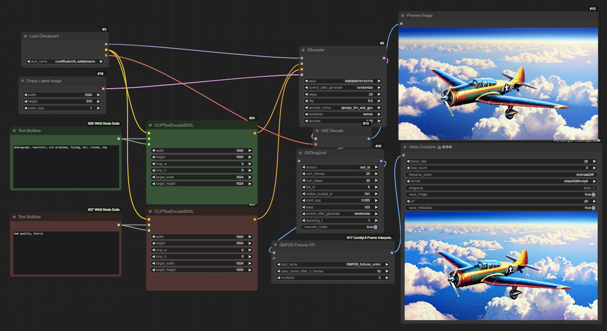

## Preliminary use of SVD in ComfyUI

DISCLAIMER: I'm NOT a proper coder, this is NOT A PROPER implementation, this is a very quick hack,  but it works for me, so I'll share it.

I used my existing ComfyUI venv and added whatever requirements was missing. This needs Pytorch 2. I might have missed some requirements so if something fails, like always, check the startup log for errors.

pip install -r requirements.txt

You need the checkpoints from here, normal one is trained for 14 images and XT for 25. Choose whichever and put them in the checkpoints folder in this custom node's folder.
https://huggingface.co/stabilityai/stable-video-diffusion-img2vid
https://huggingface.co/stabilityai/stable-video-diffusion-img2vid-xt

With default settings 25 1024x576 frames using svt_xt should run with bit under 20GB.

Again, to make it clear, this is experimental and I won't be helping with installation or take any responsibility if you break something using this!

